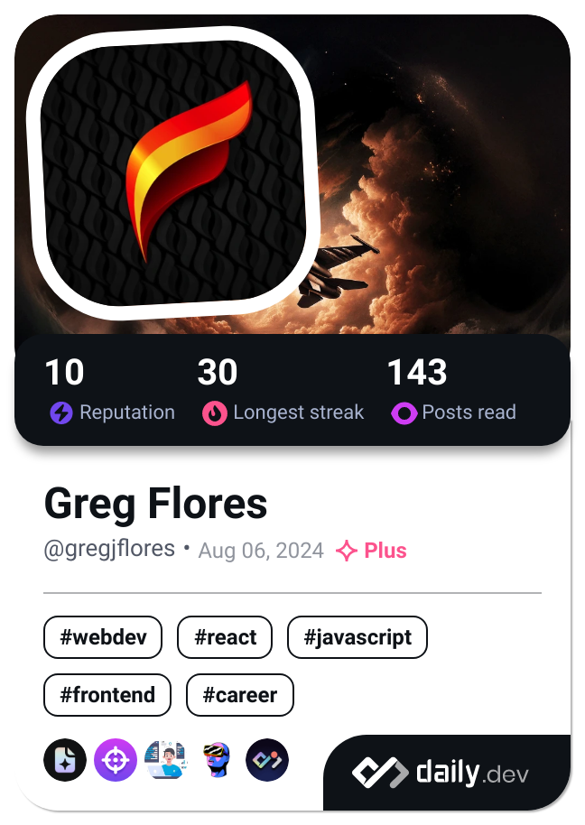

<div align="center">
  
# 👋 Hey there, I'm Greg!


</div>

<div align="center">
  
[](https://github.com/GregJFlores/GregJFlores/actions/workflows/daily-devcard.yml)
[](https://github.com/GregJFlores/GregJFlores/actions/workflows/dependabot/dependabot-updates)

</div>

---

## 🎯 About Me

```typescript
const developer = {
    name: "Gregory Flores",
    location: "Texas",
};
```

## 🛠️ Tech Arsenal

<div align="center">

### 💻 Programming Languages


### 🌐 Web Development


### 🗄️ Databases & ORMs


### 🔧 DevOps & Tools


</div>

📰 Daily.dev Card
<div align="center">
<a href="https://app.daily.dev/gregjflores"></a>
</div>

## 📈 Contribution Graph

<div align="center">
  
</div>

## 📫 Let's Connect!

<div align="center">

[](https://gregjflores.com)
[](https://linkedin.com/in/gregjflores)
[](https://twitter.com/gregjflores)

</div>

